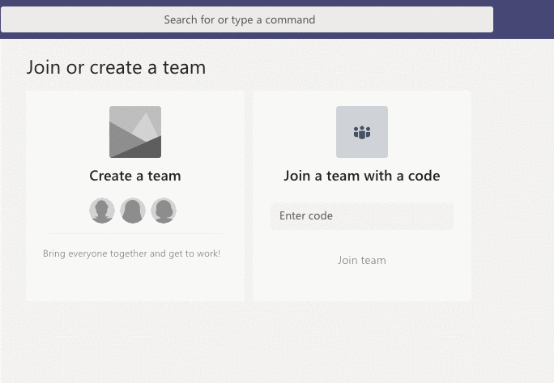

# HA-Beskrivende-Statistik-2018
Roman Jurowetzki, Ph.D.; Assistant Professor in Innovation Studies and Data Science; roman@business.aau.dk

## Rules of the Game

- Kommunikation: [Microsoft :confused: Teams](http://teams.microsoft.com/)
- Resourser: [Github](https://github.com/RJuro/HA-Beskrivende-Statistik-2018)
- Training: [Datacamp](http://datacamp.com/)
- Tools: [Google Sheets](https://www.google.com/sheets/about/), Måske [Jupyter/R](https://notebooks.azure.com/)
- Eksamen: [Peergrade](https://www.peergrade.io/)

#### [Microsoft :confused: Teams](http://teams.microsoft.com/):

Vi kommer til at bruge Teams til at kommunikere. Teams er lige som *Slack* et system til modern og professionel kommunikation. I kan bruge Teams også senere til projektarbejde mm. Nogle vejledere her på AAU bruger det allerede.

Join Code **8cul5da**

Jeg åbnede et *team* til vores kursus. Her sender jeg updates og andet. Hvis I har spørgsmål om noget, er det nok en rigtig god ide at skrive der. I Teams har I også muligheden til at åbne chats (lige som FB). 

**Jeg svarer normalt ikke på mails med spørgsmål om kursus men I må gerne skrive i chatten**

#### [Github](https://github.com/RJuro/HA-Beskrivende-Statistik-2018):
Moodle (AAU's installation) er :unamused: især når man arbejder meget med IT og kode. Github er en platform social softwareudvikling og mere som ofte bruges til undervisning. Vi skal nok ikke skrive kode her på 1. semester men for jer, der har interesse i nye teknologier, IT etc. giver det måske en mulighed at udforske en ny platform (der ikke er FB eller Insta).
Der vil ligge alle formalia omkring kursus på Moodle men resourcer er nok i kursets Github repo.

#### [Datacamp](http://datacamp.com/)
Datacamp er en online Data Science træning platform, der har mest fokus på R og Python, SQL etc. Jeg har skaffet gratis adgang til jer.
Alle af jer **SKAL** gennemføre 2 kurser
- Spreadsheet Basics
- Data Analysis with Spreadsheets
Endvidere åbner jeg for kurser under forløbet "Intro to Statistics with R", "Data Visualization with R" og Tidyverse. I må meget gerne kontakte mig hvis i vil have adgang til flere kurser. Mange af dem vil hjælpe jer også med IT modulet.
I får tilsendt et link til Datacamp.

#### [Google Sheets](https://www.google.com/sheets/about/)
Rigtig mange af jer arbejder med google docs. Google Sheets har mange af de funktioner som man kender fra Excel men skal ikke installeres og man kan nemt arbejde i en gruppe. Hvis man gerne arbejder med Excel (eller R, eller Tableau eller Python eller whatever) må man gerne bruge det.

